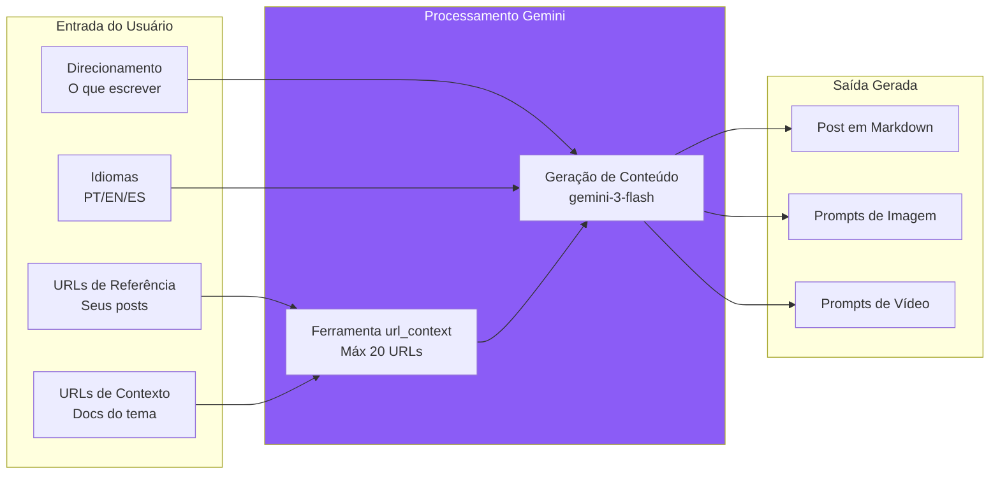
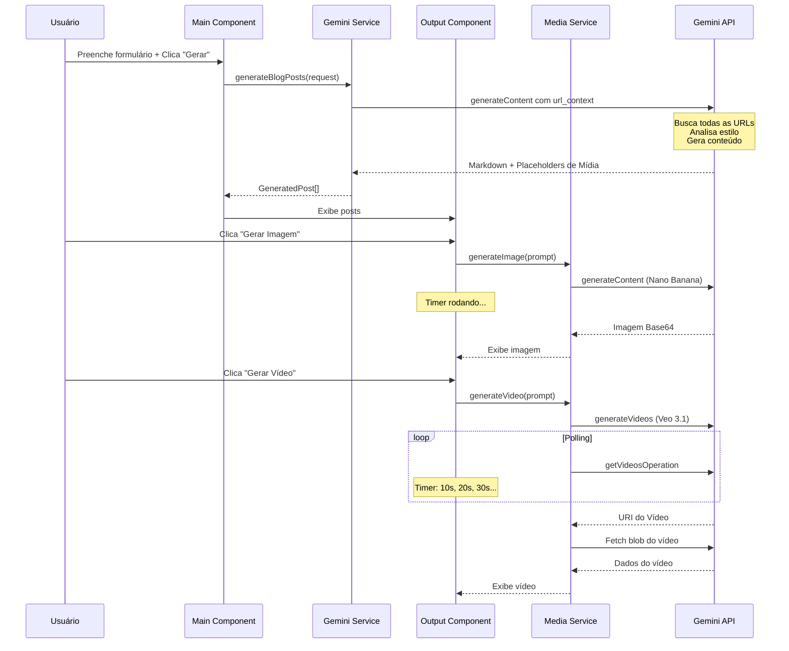

# Bloggerator

> 🚀 **Gere posts de blog profissionais com seu estilo pessoal de escrita, powered by Gemini 3 Flash.**

[](LICENSE)
[](https://angular.io/)
[](https://ai.google.dev/)
[](https://firebase.google.com/)
[](https://cloud.google.com/run)

---

## 📋 Índice

- [Funcionalidades](#-funcionalidades)
- [Arquitetura](#-arquitetura)
- [Fluxo de Geração](#-fluxo-de-geração)
- [Pré-requisitos](#-pré-requisitos)
- [Instalação](#-instalação)
- [Desenvolvimento](#-desenvolvimento)
- [Deploy](#-deploy)
- [Guia de Uso](#-guia-de-uso)
- [Limites da API](#-limites-da-api)
- [Stack Tecnológica](#-stack-tecnológica)
- [Licença](#-licença)

---

## ✨ Funcionalidades

| Funcionalidade | Descrição |
|----------------|-----------|
| 🎨 **Extração de Estilo** | Analisa seus posts anteriores para capturar seu tom, formato e voz únicos |
| 🌐 **Geração Multilíngue** | Gera posts em PT-BR, EN e ES simultaneamente |
| 🔗 **Contexto via URL** | Usa até 20 URLs como contexto (5 referência + 15 tema) via `url_context` do Gemini |
| 🖼️ **Geração de Imagens com IA** | Cria imagens com Nano Banana (gemini-3-pro-image-preview) |
| 🎬 **Geração de Vídeos com IA** | Gera vídeos com Veo 3.1 (veo-3.1-generate-preview) |
| ⏱️ **Progresso em Tempo Real** | Timer para cada geração de mídia com processamento paralelo |
| ✏️ **Prompts Editáveis** | Edite os prompts de mídia antes de gerar |
| 📋 **Exportar Markdown** | Copie o post final pronto para publicar |
| 🔑 **Modelo BYOK** | Bring Your Own Key - sua API key fica apenas na sua sessão |
| 🌙 **Tema Dark/Light** | Suporte completo a temas com transições suaves |
| 🌍 **Interface i18n** | Interface disponível em PT-BR, EN e ES |

---

## 🏗️ Arquitetura

### Diagrama de Componentes

```mermaid
graph TB
    subgraph Frontend["Angular 21 SPA"]
        subgraph Components["Componentes"]
            LOGIN[Login Component]
            MAIN[Main Component]
            OUTPUT[Output Component]
            SETTINGS[Settings Component]
        end
        
        subgraph Services["Serviços"]
            AUTH[Auth Service]
            GEMINI[Gemini Service]
            MEDIA[Media Service]
            APIKEY[API Key Service]
            I18N[I18n Service]
            THEME[Theme Service]
        end
    end
    
    subgraph External["APIs Externas"]
        FBAUTH[Firebase Auth]
        GEMAPI[Gemini 3 Flash API]
        NANO[Nano Banana API]
        VEO[Veo 3.1 API]
    end
    
    LOGIN --> AUTH
    MAIN --> GEMINI
    MAIN --> OUTPUT
    OUTPUT --> MEDIA
    SETTINGS --> APIKEY
    SETTINGS --> I18N
    
    AUTH --> FBAUTH
    GEMINI --> GEMAPI
    MEDIA --> NANO
    MEDIA --> VEO
    
    style Frontend fill:#1a2234,stroke:#6366f1
    style GEMINI fill:#8B5CF6
    style MEDIA fill:#06B6D4
```



### Fluxo de Dados



---

## 🔄 Fluxo de Geração



---

## 📦 Pré-requisitos

| Requisito | Versão | Propósito |
|-----------|--------|-----------|
| Node.js | 22+ | Runtime |
| npm | 10+ | Gerenciador de pacotes |
| Projeto Firebase | - | Autenticação |
| Gemini API Key | - | Geração com IA |

### Obtenha sua API Key

1. Acesse [Google AI Studio](https://aistudio.google.com/)
2. Clique em **Get API Key**
3. Crie uma nova chave ou use uma existente
4. Salve-a - você vai inserir no app

---

## 🚀 Instalação

```bash
# Clone o repositório
git clone https://github.com/lucianommartins/bloggerator.git
cd bloggerator

# Instale as dependências
npm install

# Configure o Firebase
cp src/environments/environment.example.ts src/environments/environment.ts
```

Edite `src/environments/environment.ts` com suas credenciais do Firebase:

```typescript
export const environment = {
  production: false,
  firebase: {
    apiKey: "SUA_FIREBASE_API_KEY",
    authDomain: "seu-projeto.firebaseapp.com",
    projectId: "seu-projeto-id",
    // ... outras configs do Firebase
  }
};
```

---

## 💻 Desenvolvimento

```bash
# Inicia servidor de desenvolvimento
npm run dev

# Build para produção
npm run build

# Roda testes
npm run test
```

Acesse em **http://localhost:4200**

---

## 🚀 Deploy

O Bloggerator está deployado no **Google Cloud Run** em [bloggerator.lmm.ai](https://bloggerator.lmm.ai).

Para fazer seu próprio deploy:

```bash
# Configure o projeto GCP
export GOOGLE_CLOUD_PROJECT="seu-project-id"

# Execute o script de deploy
./deploy/cloudrun/deploy.sh
```

📖 Documentação completa de deploy: [`deploy/cloudrun/README.md`](deploy/cloudrun/README.md)

---

## 📖 Guia de Uso

### Passo a Passo

```mermaid
graph LR
    A[1. Login<br/>Google Auth] --> B[2. API Key<br/>Insira sua chave]
    B --> C[3. URLs Referência<br/>Seus blog posts]
    C --> D[4. URLs Contexto<br/>Recursos do tema]
    D --> E[5. Direcionamento<br/>O que escrever]
    E --> F[6. Idiomas<br/>Selecione destinos]
    F --> G[7. Gerar<br/>Clique no botão]
    G --> H[8. Revisar<br/>Edite prompts]
    H --> I[9. Mídia<br/>Gere imagens/vídeos]
    I --> J[10. Exportar<br/>Copie Markdown]
    
    style A fill:#10B981
    style G fill:#8B5CF6
    style J fill:#F59E0B
```



### Dicas para Melhores Resultados

| Dica | Descrição |
|------|-----------|
| 📝 **Use 2-5 posts de referência** | Mais contexto = melhor correspondência de estilo |
| 🔗 **Adicione docs oficiais** | Precisão técnica melhora com materiais fonte |
| ✍️ **Seja específico no direcionamento** | "Blog técnico sobre X, focando em Y, com tom Z" |
| 🎨 **Edite os prompts de mídia** | Personalize antes de gerar para melhores resultados |

---

## 📊 Limites da API

| Recurso | Limite | Motivo |
|---------|--------|--------|
| URLs de Referência | 5 | Extração de estilo |
| URLs de Contexto | 15 | Contexto do tema |
| **Total de URLs** | **20** | Limite do `url_context` do Gemini |
| Idiomas | 3 | PT-BR, EN, ES |

---

## 🛠️ Stack Tecnológica

### Frontend

| Tecnologia | Versão | Propósito |
|------------|--------|-----------|
| Angular | 21.1 | Framework |
| TypeScript | 5.7 | Linguagem |
| Angular Signals | - | Estado reativo |
| SCSS | - | Estilização |

### Serviços de IA

| Serviço | Modelo | Propósito |
|---------|--------|-----------|
| Gemini 3 Flash | gemini-3-flash-preview | Geração de texto |
| Nano Banana | gemini-3-pro-image-preview | Geração de imagens |
| Veo 3.1 | veo-3.1-generate-preview | Geração de vídeos |

### Infraestrutura

| Serviço | Propósito |
|---------|-----------|
| Firebase Auth | Autenticação Google |
| Session Storage | Armazenamento da API key (BYOK) |

---

## 📁 Estrutura do Projeto

```
bloggerator/
├── src/
│   ├── app/
│   │   ├── components/
│   │   │   ├── login/          # Página de login
│   │   │   ├── main/           # UI principal do gerador
│   │   │   ├── output/         # Exibição do conteúdo gerado
│   │   │   └── settings/       # Modal de configurações
│   │   ├── services/
│   │   │   ├── auth.service.ts
│   │   │   ├── gemini.service.ts
│   │   │   ├── media.service.ts
│   │   │   ├── api-key.service.ts
│   │   │   └── theme.service.ts
│   │   ├── i18n/               # Traduções
│   │   │   ├── pt-br.ts
│   │   │   ├── en.ts
│   │   │   └── es.ts
│   │   └── models/             # Interfaces TypeScript
│   ├── environments/           # Config do Firebase
│   └── styles.css              # Estilos globais
├── angular.json
├── package.json
└── README.md
```

---

## ⚠️ Notas Importantes

> [!NOTE]
> Este é um protótipo experimental. As chamadas de API são feitas diretamente do navegador usando sua API key.

> [!WARNING]
> Sua API key do Gemini é armazenada no localStorage do navegador. Nunca compartilhe sua API key.

> [!TIP]
> Para uso em produção, considere adicionar um backend proxy para proteger suas API keys.

---

## 📄 Licença

Este projeto está licenciado sob a **Licença Apache 2.0** - veja o arquivo [LICENSE](LICENSE) para detalhes.

---

## 🙏 Agradecimentos

- [Google Gemini](https://ai.google.dev/) pelas poderosas APIs de IA
- [Angular](https://angular.io/) pelo excelente framework
- [Firebase](https://firebase.google.com/) pela infraestrutura de autenticação

---

## ⚖️ Disclaimer

> **Este é um projeto experimental e não é um produto oficial do Google.**
>
> Este software é fornecido "como está", sem garantias de qualquer tipo. Use por sua conta e risco. O autor não se responsabiliza por quaisquer danos decorrentes do uso deste software.
>
> Google, Gemini, Firebase e outras marcas mencionadas são marcas registradas de seus respectivos proprietários.
